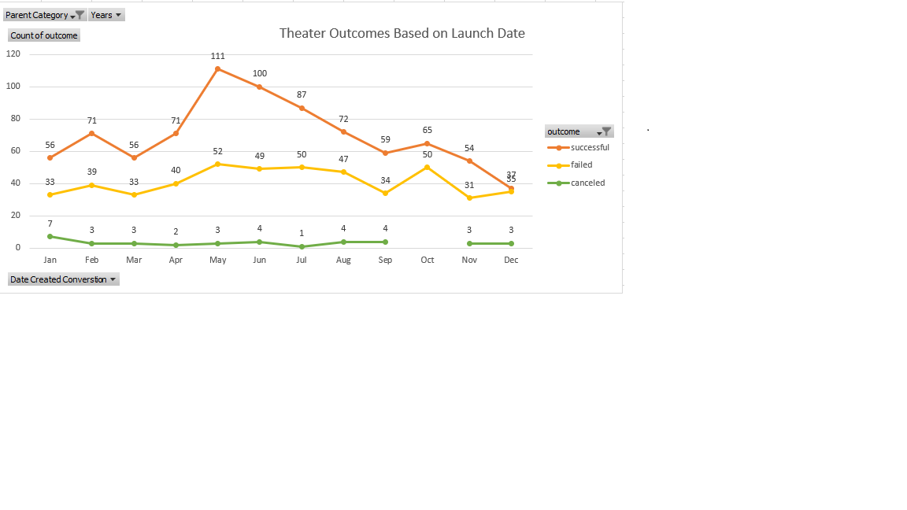

# Kickstarting with Excel
Using the Kickstarter dataset, I'm analyzing whether there are any common trends that could assist Louise reach her campaign funding goals.

## Overview of Project
Looking at Kickstarter statistics to help Louise understand more about crowdfunding campaigns and what criteria would help her create a successful $10,000 campaign for her play "Fever."

### Purpose
We need to provide Louise visible feedback and insights so she can analyze the campaign from beginning to end and structure her own campaign based on successful ones in the same category.

## Analysis and Challenges
I realized the raw data needed to be sorted and prepared for analysis upon review, so I added new columns to the Kickstarter dataset to display Percentage funded, Average Donation, Parent Category and Subcategory, Date Created Conversion, Date Ended Conversion, and the year the campaign was launched.

### Analysis of Outcomes Based on Launch Date
Over a period of time, plays in the Theater category were the most popular. We can observe all of the trend history for the most active months using a line graph for theater results for launch date. The months of May and June had the most successful theater campaigns, while December had the least. After studying the statistics, it appears that May or June would be the best months to begin the play.

### Analysis of Outcomes Based on Goals
We can better grasp the trends in each range of goals by using a line graph for outcomes based on goal. Goals with a value of less than 1000 were 76 percent successful, while those with a value of $45000 to $49999 were unsuccessful.

### Challenges and Difficulties Encountered
To begin the fundamental analysis, the Kickstarter dataset has to be sorted and arranged. To display specific results, I had to refine the searches using filters and update the chart.

## Results
- What are two conclusions you can draw about the Outcomes based on Launch Date?
Based on the clear success percentage rate in all categories and the percentage rate in the Play's category, I recommend Louise launch her campaign in May or June.
- What can you conclude about the Outcomes based on Goals?
The line graph shows that the outcomes are predicated on a 50% possibility of the goal occuring, so I would advise Louise to keep the wager around $10,000.
- What are some limitations of this dataset?
The information contained in the data set was somewhat old. The analysis of this data collection would have been more accurate if they had provided up-to-date data.
- What are some other possible tables and/or graphs that we could create?
The Theater Outcomes Based on Launched Date line chart can be displayed using a clustered column chart.The Outcomes Based on Goals line chart can be displayed using a stacked column chart.
